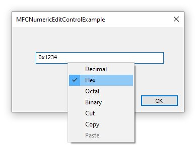

## **MFC CNumericEditControl**

Simple replacement for MFC CEdit class that implements numeric decimal/hex/octal/binary input
with clipboard and format conversion support.

### Features

1. Input numeric value as decimal, hex, octal or binary 
2. Convert to any other numeric format using UI context menu
3. Convert to any other numeric format at runtime using ChangeMode() method
4. Full clipboard support

Hex input may optionally be prefixed with "0x"	and octal may optionally prefixed with "0". 
The control does not use PreTranslateMessage(). and can be used in both standard MFC applications and DLL projects that do not have a message loop. 

The current input mode is displayed using a "cue" or watermark text.

### MFC usage instructions

1. Add "CNumericEditControl.h" and "CNumericEditControl.cpp" to your MFC project
2. If necessary, add common controls manifest (see "stdafx.h" in example project)
3. #include "CNumericEditControl.h"
4. Add edit control to your dialog
5. Add control variable for the edit control	
6. Change the control variable type from CEdit to CNumericEditControl
7. Use the control as normal
8. Use methods AsString() or AsValue() to access value
9. If necessary, call ChangeMode() to change the display mode at runtime

## Licensing
This software is available under the **"MIT License".**  
[https://github.com/datasynergyuk/CNumericEditControl/blob/master/LICENSE](https://github.com/datasynergyuk/CNumericEditControl/blob/master/LICENSE)